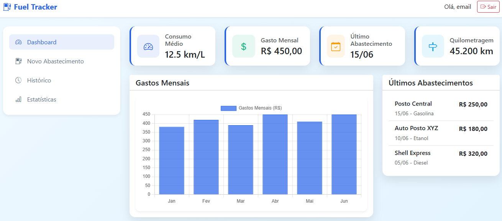
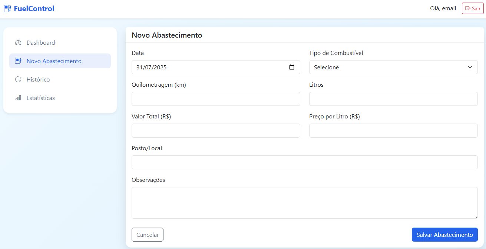

# Fuel Tracker ⛽

**Fuel Tracker** é um aplicativo web completo para controle pessoal de abastecimentos de combustível, permitindo registrar, acompanhar e analisar seus gastos com gasolina, etanol, diesel e GNV. Com gráficos intuitivos e cálculos automáticos, você economiza tempo e dinheiro gerenciando seu consumo de forma inteligente.

## 🌐 Acesse o Projeto

Você pode acessar o projeto online clicando no link abaixo:

🔗 [Acesse o projeto online](https://fuel-tracker-one.vercel.app/)

## 📸 Print da Página

## 🛠️ Tecnologias Utilizadas

  

## Desenvolvedor

| [ Demetrius Vignati](https://github.com/demetriusvas) |
| :---: |